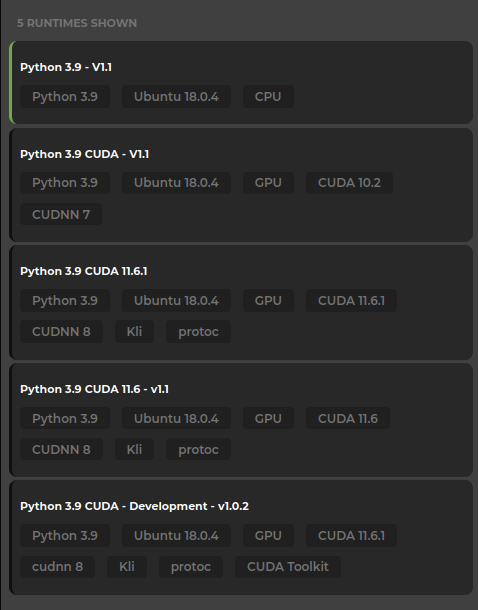

# Konstellation Runtimes

Konstellation runtime images to be used in KDL and KRE

## Table of contents

<!-- START doctoc generated TOC please keep comment here to allow auto update -->
<!-- DON'T EDIT THIS SECTION, INSTEAD RE-RUN doctoc TO UPDATE -->

- [Making a new runtime available](#making-a-new-runtime-available)
- [Image bases](#image-bases)
- [Contributing](#contributing)
  - [Pull requests](#pull-requests)
  - [Semantic release](#semantic-release)
  - [Branching conventions](#branching-conventions)

<!-- END doctoc generated TOC please keep comment here to allow auto update -->

## Making a new runtime available

After successfully building a new runtime image, you can add it to the list of available runtime images in KAI Lab adding a new document to the `kdl` MongoDB database, under the `runtimes` collection, following the schema below.

```json
{
  "name": "",
  "desc": "Description",
  "labels": ["Python 3.9", "Ubuntu 18.0.4", "GPU", "CUDA 11.6.1"],
  "docker_image": "konstellation/kdl-py",
  "docker_tag": "3.9-cuda11.6-cudnn8-devel-1.0.2"
}
```

## Image bases

It can be confusing at first to know why runtime or devel CUDA images have been used as base images for our runtimes. To make a concise explanation, we can resume that NVIDIA's CUDA images are built with the following purposes in mind:

- base: starting from CUDA 9.0, contains the bare minimum (libcudart) to deploy a pre-built CUDA application. Use this image if you want to manually select which CUDA packages you want to install.

- runtime: extends the base image by adding all the shared libraries from the CUDA toolkit. Use this image if you have a pre-built application using multiple CUDA libraries.

- devel: extends the runtime image by adding the compiler toolchain, the debugging tools, the headers and the static libraries. Use this image to compile a CUDA application from source.

So, meanwhile you're not sure which image you should use, you can follow this rule of thumb to select the right runtime for your experiments:

- If you're not sure of what runtime to choose, choose the runtime version (the one that is not labeled with "Development").
- If you need `nvcc` or whichever compiler tools, choose the runtime labeled "Development".



## Contributing

### Pull requests

Accepted pull requests for Docker image updates could only contain changes for a single image.

Example:

Given the following project folder structure:

```
docker\
  py3.9\
    Dockerfile
    ...
  py3.10\
    Dockerfile
    ...
```

Pull requests containing changes for both `docker/py3.9` and `docker/py3.10` folders won't be accepted because that could cause the `New Release` workflow to fail.

### Semantic release

This project follows [Angular commit guidelines](https://github.com/angular/angular.js/blob/master/DEVELOPERS.md#-git-commit-guidelines) for commits because [semantic release](https://github.com/semantic-release/semantic-release) in conjunction with [semantic-release-monorepo](https://github.com/pmowrer/semantic-release-monorepo) is used, so commits that follow the styles message could upgrade the version automatically.

**CAUTION**:

If this approach is not followed, the automation won't upgrade the version and publish the changelog on the repo.

### Branching conventions

Each Dockerfile modification branch should be named like follows:

[action]/[docker_image]\_[message]

- **action**: The available actions are fix, refactor, feature and docs.
- **docker_image**: The name of the folder inside `docker/` that represents a Dockerfile.
- **message**: A general and short message that explain the task or a small title.

For non Dockerfile modification branches:

[action]/[message]

- **action**: The available actions are fix, refactor, feature and docs.
- **message**: A general and short message that explain the task or a small title.
